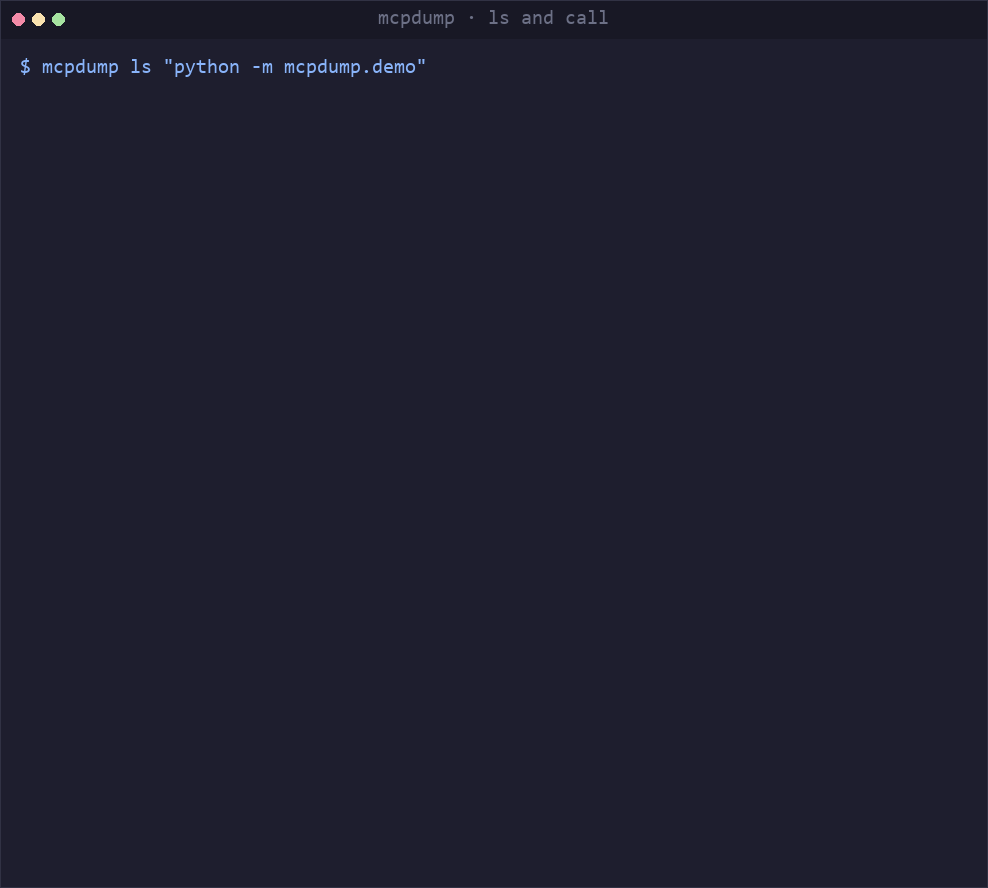

# mcpdump

**The missing terminal toolkit for MCP servers.** Inspect, call, watch and test any Model Context Protocol server — without leaving your shell.

> **Why the name?** `tcpdump` is what you reach for when you need to see what is really on the
> wire. `mcpdump` is that idea one layer up: it prints the raw JSON-RPC frames, records a session
> to a file, and replays that file later on a machine that has neither the server nor the client.

<p align="center">
  <a href="https://github.com/xsw77492-code/mcpdump/actions/workflows/ci.yml"></a>
  
  
  <a href="LICENSE"></a>
</p>



<p align="center">
  <a href="README.md">English</a> · <a href="README.zh-CN.md">简体中文</a>
</p>

---

## Why

MCP is now the de-facto standard for connecting AI agents to tools. GitHub and the public registries already list **10,000+ MCP servers** — and the tooling around them has not kept up.

If you have ever built an MCP server, you know these three moments:

1. **"Did my server even start?"** — Your client shows nothing. The server may have crashed on line 3, or it may be printing a banner to stdout and corrupting the JSON stream. You have no idea which.
2. **"What does this server actually expose?"** — You need the full tool list with parameter schemas, not a truncated dropdown in a chat UI.
3. **"The agent called my tool wrong — what did it actually send?"** — Without the raw JSON-RPC frames you are guessing.

The official MCP Inspector is a browser GUI: heavy to launch, impossible to script, and useless in CI. `mcpdump` takes the opposite position — **terminal-native, scriptable, CI-friendly.**

## What makes it different

- **A real terminal UI, not a browser tab.** `mcpdump tui` puts the server identity, the tool list, the live wire traffic and a latency timeline on one screen — `tab` to switch panes, `⏎` to call a tool. No alt-screen takeover: the last frame stays in your scrollback as evidence.
- **Zero protocol dependencies.** The JSON-RPC codec and both transports are implemented here, not imported from an SDK. A debugging tool must own the wire format — that is the whole point.
- **Wire-level by default.** `mcpdump call` prints the exact request and response frames, unmodified, with timings.
- **Transparent by construction.** `mcpdump watch` sits between any client and any server, forwarding every frame byte for byte. It does not interpret, buffer, reorder or re-encode anything — so the client cannot tell it is there.
- **Reproducible by construction.** `mcpdump record` writes a session to disk; `mcpdump replay` walks it back **without starting a process or touching the network**, and `mcpdump diff` reports what actually changed between two recordings — tools, parameter schemas, capabilities, latency — while ignoring the timestamps that differ on every run. Replaying the same file twice gives byte-identical output, so a recording attached to an issue shows the maintainer exactly what you saw.
- **No command typing.** `mcpdump discover` reads the MCP configs of the clients you already use — Claude Desktop, Cursor, VS Code, Claude Code, Windsurf, Cline, Continue, Zed, OpenClaw — and hands you the list. It never prints your API keys, only the variable names.
- **Machine-readable everywhere.** Every command supports `--json` with a stable schema. Exit codes are meaningful (`0` ok / `1` usage / `2` server error / `3` timeout / `4` environment).
- **Conformance checking built in.** `mcpdump check` runs 10 spec checks and hands you the evidence, not a verdict — the offending frame is printed alongside the clause it breaks. Exit codes make it a CI gate, `--badge` makes it a README trophy, `--markdown` makes it a pull request comment — and a GitHub Action does exactly that.
- **Instant install.** Two dependencies (`typer`, `rich`). `uvx mcpdump` starts in well under a second.

## Quick start

No API key, no Node.js, no configuration. An example MCP server ships **inside** `mcpdump`,
so the whole toolkit can be tried in two lines:

```bash
pip install mcpdump
mcpdump demo
```

`mcpdump demo` runs three steps against that built-in server and prints their real output —
the same output you get by typing the commands yourself:

```text
1. What does this server expose?                                        mcpdump ls
───────────────────────────────────────────────────────────────────────────────
┌──────────────── echo-server v0.1.0  (mcpdump sample server) ────────────────┐
│    transport  stdio · python -m mcpdump.demo                                │
│     protocol  2025-06-18                                                    │
│ capabilities  tools · resources · prompts                                   │
│ instructions  A sample MCP server for testing mcpdump, exposing the echo /  │
│               add / boom tools.                                             │
└─────────────────────────────────────────────────────────────────────────────┘
Tools (3)
┌──────┬────────────────────────┬─────────────────────────────────────────────┐
│ name │ arguments              │ description                                 │
├──────┼────────────────────────┼─────────────────────────────────────────────┤
│ echo │ (text: string)         │ Returns the input text unchanged. Use it to │
│      │                        │ verify the link is alive.                   │
│ add  │ (a: number, b: number) │ Adds two numbers.                           │
│ boom │ —                      │ Always returns isError=true; used to test   │
│      │                        │ mcpdump's error rendering.                  │
└──────┴────────────────────────┴─────────────────────────────────────────────┘
…

2. What does a tool call actually send and receive?     mcpdump call <SERVER> echo
───────────────────────────────────────────────────────────────────────────────
→ initialize
  {"jsonrpc":"2.0","id":1,"method":"initialize","params":{"protocolVersion":"2…
← initialize                                                           894.7 ms
  {"jsonrpc": "2.0", "id": 1, "result": {"protocolVersion": "2025-06-18", "cap…

→ tools/list
  {"jsonrpc":"2.0","id":2,"method":"tools/list","params":{}}
← tools/list                                                             0.2 ms
  {"jsonrpc": "2.0", "id": 2, "result": {"tools": [{"name": "echo", "title": "…

→ tools/call
  {"jsonrpc":"2.0","id":3,"method":"tools/call","params":{"name":"echo","argum…
← tools/call                                                             0.1 ms
  {"jsonrpc": "2.0", "id": 3, "result": {"content": [{"type": "text", "text": …

3 round trips · 895.1 ms total · slowest ← initialize 894.7 ms

┌── Tool result ──┐
│ hello from mcpdump │
└─────────────────┘

3. Does it follow the MCP spec?                                      mcpdump check
───────────────────────────────────────────────────────────────────────────────
Conformance report
10 checks · 10 passed · 0 failed · 0 skipped
…
```

Abridged — the `…` marks stand for the Resources and Prompts tables, the ten passing
checks, and the closing `Next` block. The full run is 98 lines in 6.5 seconds.

The rest of this document points at that same built-in server, so its examples are
copy-pasteable. One caveat: `python -m mcpdump.demo` needs `python` on your `PATH` to be the
interpreter that has `mcpdump` installed — which is **not** true for `uvx`, `pipx`, or an
activated virtualenv. If it fails with `No module named 'mcpdump'`, run `mcpdump demo --cmd`
to print the exact launch command for your installation.

Against a real server:

```bash
mcpdump discover   # find MCP servers already configured on this machine
mcpdump ls "npx -y @modelcontextprotocol/server-filesystem /tmp"
mcpdump call "npx -y @modelcontextprotocol/server-filesystem /tmp" read_file \
  --args '{"path":"/tmp/notes.md"}'
```

### Install

```bash
pip install mcpdump      # into the current environment
pipx install mcpdump     # as an isolated CLI
uvx mcpdump demo         # run once without installing
```

Requires Python 3.10+.

## Commands

### `mcpdump demo`

The fastest way in. Runs `ls`, `call` and `check` against the server that ships **inside**
`mcpdump` — no arguments, no config, no network — and prints each step's real output, which is
the same output you get by typing those three commands yourself.

```bash
mcpdump demo
mcpdump demo --cmd     # print the launch command for the built-in server, then exit
```

`--cmd` exists because the built-in server is started through the interpreter that has
`mcpdump` installed, which is not always the `python` on your `PATH` — the caveat under
[Quick start](#quick-start) explains when that matters.

### `mcpdump ls <server>`

Handshake with the server and print its identity, protocol version, declared capabilities, tools, resources and prompt templates.

```bash
mcpdump ls "npx -y @modelcontextprotocol/server-filesystem /tmp"
mcpdump ls "npx -y @modelcontextprotocol/server-filesystem /tmp" --json   # for scripts
mcpdump ls "npx -y @modelcontextprotocol/server-filesystem /tmp" -v       # expand schemas
mcpdump ls https://mcp.example.com/mcp                                    # remote, over HTTP
```

`mcpdump` only calls `resources/list` and `prompts/list` when the server actually declares those capabilities — sending them anyway is a protocol violation, and a lot of clients get this wrong.

**stdio or Streamable HTTP — same command, same output.** An `http(s)://` argument switches the
transport; everything else is identical. Both `application/json` and `text/event-stream`
responses are handled, `Mcp-Session-Id` is remembered and sent back on every subsequent
request, and the session is closed with a `DELETE` on exit. It is built on the standard
library, so the runtime dependencies are still just `typer` and `rich`.

### `mcpdump call <server> <tool>`

Call a tool and print the complete round trip.

```bash
mcpdump call "python -m mcpdump.demo" echo --args '{"text":"hi"}'
mcpdump call "python -m mcpdump.demo" add  --args '{"a":3,"b":4}' --no-wire
mcpdump call "python -m mcpdump.demo" echo --args '{"text":"hi"}' --full
mcpdump call "python -m mcpdump.demo" echo --args '{"text":"hi"}' --json
```

Sample output — every frame, every timing:

```text
→ initialize
  {"jsonrpc":"2.0","id":1,"method":"initialize","params":{"protocolVersion":"2…
← initialize                                                           724.7 ms
  {"jsonrpc": "2.0", "id": 1, "result": {"protocolVersion": "2025-06-18", "cap…

→ tools/list
  {"jsonrpc":"2.0","id":2,"method":"tools/list","params":{}}
← tools/list                                                             0.2 ms
  {"jsonrpc": "2.0", "id": 2, "result": {"tools": [{"name": "echo", "title": "…

→ tools/call
  {"jsonrpc":"2.0","id":3,"method":"tools/call","params":{"name":"echo","argum…
← tools/call                                                             0.2 ms
  {"jsonrpc": "2.0", "id": 3, "result": {"content": [{"type": "text", "text": …

3 round trips · 725.1 ms total · slowest ← initialize 724.7 ms

┌─ Tool result ─┐
│ hi            │
└───────────────┘
```

Frames are truncated to your terminal width. Pass `--full` to see them in their
entirety — nothing is reformatted or re-serialised either way, so what you read is
what actually crossed the pipe.

If you typo a tool name, `mcpdump` suggests the closest matches instead of dumping an opaque error.

### `mcpdump tui <server>`

Everything at once, on one screen — server identity, tools, live traffic, and how long each call took. A real capture (`--script "enter,h,i,enter,enter,o,k,enter,q"`), with only the interpreter path shortened:

```
┌────────────────────────────────── Server ───────────────────────────────────┐
│ echo-server v0.1.0 · stdio · ~/…/binaries/…/python.exe -m mcpdump.demo         │
├─ Tools · 3 ───────────┬─ Wire · 8 ──────────────────────────────────────────┤
│▸ echo       Returns t…│ ⋯ 1 older                                           │
│  add        Adds two …│  ← initialize                                 1.22 s│
│  boom       Always re…│  {"jsonrpc": "2.0", "id": 1, "result": {"protocolVe…│
│                       │  → tools/list                                       │
│                       │  {"jsonrpc":"2.0","id":2,"method":"tools/list","par…│
│                       │  ← tools/list                                 0.2 ms│
│                       │  {"jsonrpc": "2.0", "id": 2, "result": {"tools": [{…│
│                       │  → tools/call                                       │
│                       │  {"jsonrpc":"2.0","id":3,"method":"tools/call","par…│
│                       │  ← tools/call                                 0.2 ms│
│                       │  {"jsonrpc": "2.0", "id": 3, "result": {"content": …│
│                       │  → tools/call                                       │
│                       │  {"jsonrpc":"2.0","id":4,"method":"tools/call","par…│
│                       │▸ ← tools/call                                 0.2 ms│
│                       │  {"jsonrpc": "2.0", "id": 4, "result": {"content": …│
├───────────────────────┴─────────────────────────────────────────────────────┤
 Timeline · 2 calls · p50 0.3 ms · max 0.3 ms                                  
 echo            ████████████████████████████████████████████▋      0.3 ms     
 echo            ██████████████████████████████████████████████     0.3 ms     
                                                                               
└─────────────────────────────────────────────────────────────────────────────┘
 BROWSE  tab panes · ↑↓ move · ⏎ call · / filter · q quit                      
```

The tool descriptions are the strings the example server itself returns — `mcpdump` never rewrites what a server sends.

| Key | |
|---|---|
| `tab` | move focus between tools, wire and timeline |
| `↑` `↓` | move within the focused pane — in the wire and timeline, `↑` scrolls *back* in time |
| `⏎` | call the selected tool; on a frame, expand it to the full payload |
| `/` | filter tools as you type — name, title or description |
| `q` | quit |

Worth knowing:

- **No full-screen repaint.** `Live(screen=False)` rewrites only the lines that changed, and redraws are driven by *state changes* rather than a timer — nothing is written while you sit still.
- **The last frame stays in your scrollback.** No alt-screen takeover. Scroll up after quitting and the screen is still there, which is exactly what a debugging tool should leave behind.
- **Latency outliers are flagged for you.** Every call is drawn as a half-cell water bar scaled against the session **median**; a call is marked `⚠` only when it is both `≥1.5×` the median *and* `≥+50 ms` slower. Median, not mean — one 30-second timeout would drag a mean up tenfold and make every later call look fast.
- **Failures are not drawn as short bars.** A bar has a length, and "failed" is not a length. Those rows get `✗` and the reason instead.
- **Arguments come from the schema.** `⏎` on a tool that needs parameters opens a one-line JSON skeleton generated from its `inputSchema` — required parameters only, cursor already inside the first string. Edit, press `⏎` again. There is no form widget to fight with.
- **Recordable without hand speed.** `mcpdump tui --script "tab,enter,q"` drives the UI from a key sequence, so a demo recording and a CI smoke test run the same reproducible path.

Two things it deliberately refuses to do:

- **It will not start without a real terminal.** Piped output and `TERM=dumb` are both rejected, with a command you can copy instead (`mcpdump ls <SERVER>`). On a dumb terminal Rich reports the size as a fixed 80×25, so anything drawn there would be *wrong*, not merely ugly.
- **It will not let the server's stderr shred the screen.** `Live` repaints stdout in place, so the stderr passthrough is switched off for the duration. Use `mcpdump watch` or `mcpdump call` when you want those logs.

### `mcpdump check <server>`

Run 10 protocol conformance checks against any MCP server. Every failure comes with
the spec clause it breaks **and the raw frame that proves it** — not a summary you
have to take on faith.

```bash
mcpdump check "python -m mcpdump.demo"
mcpdump check "npx -y @modelcontextprotocol/server-filesystem /tmp" --json   # for CI
mcpdump check "python -m mcpdump.demo" --badge                       # paste-ready badge
mcpdump check "python -m mcpdump.demo" --markdown                    # for a PR comment
```

Passing checks take one line each; only failures expand:

```text
Conformance report
10 checks · 9 passed · 1 failed · 0 skipped

✓ handshake-protocol-version  initialize returns protocolVersion

✓ handshake-initialized-order  no server request before initialized

…

✗ error-invalid-params-code  missing arguments return -32602
  spec: MCP tools: missing required arguments map to -32602 Invalid params
    needs-arg ran successfully without its required arguments; the caller thinks its input took effect.
      evidence: {"jsonrpc": "2.0", "id": 7, "result": {"content": [{"type": "t…

✗ 1 of 10 checks failed.
```

Exit code is `0` when everything passes and `2` otherwise, so it drops straight into CI:

```yaml
- run: mcpdump check "$MCP_SERVER" --json > conformance.json
```

`--markdown` prints the same report as Markdown, for a pull request comment or a CI
summary. Nothing is wrapped or colourised, so it pipes straight into a file:

```bash
mcpdump check "python -m mcpdump.demo" --markdown >> "$GITHUB_STEP_SUMMARY"
```

`--json`, `--badge` and `--markdown` are mutually exclusive — pick one per run.

#### GitHub Action

`--markdown` is what the Action is built on: the formatting lives in `mcpdump`, where it
is covered by tests, instead of in YAML. The integration is a single `uses:` — the step
above it is your own build, not ours:

```yaml
# .github/workflows/conformance.yml
name: conformance
on: [push, pull_request]

jobs:
  mcpdump:
    runs-on: ubuntu-latest
    permissions:
      pull-requests: write     # to comment; the job summary needs no permission
    steps:
      - uses: actions/checkout@v7
      - run: npm ci            # whatever your server needs before it can start
      - uses: xsw77492-code/mcpdump@v1
        with:
          server: node build/index.js
```

What you get:

- **The report always lands in the job summary.** No token, no permissions, and it works on
  pull requests from forks — where it is also visible under the Checks tab.
- **The comment is updated in place, not appended.** The Action finds its previous comment
  by an HTML marker and edits it, so ten pushes leave one comment rather than ten.
- **The job fails with mcpdump's own exit code**, after the report has been published —
  never before, or you would lose the reason.

Inputs: `server` (required), `version`, `python-version`, `install`, `comment`, `token`.
Outputs: `conformant`, `exit-code`, `report`.

Two caveats worth knowing up front:

- **A pull request from a fork cannot be commented on** with the default workflow token. The
  Action detects that case, prints a warning, and leaves the report in the job summary.
- **`@v1` and the package version are independent.** Pinning the Action tag does not pin the
  package; set `version: 0.1.0` if you want both frozen.

`--badge` prints a single line of Markdown. The colour tracks the score — `10/10` is
bright green, below 60% is red:

```markdown
[](https://github.com/xsw77492-code/mcpdump?utm_source=badge&utm_medium=readme&utm_campaign=conformance)
```

**Adding a check is adding a file.** Drop a module in `src/mcpdump/services/checks/`,
export `CHECKS = (YourCheck(),)`, and the registry picks it up — no core code changes.
The numeric filename prefix is the execution order, not decoration: `stdout-purity`
must run last because it reads everything the session accumulated, and running it
early would turn a real violation into a false pass.

### `mcpdump watch <server>`

Sit between a client and a server. `mcpdump watch` launches the real server, forwards
every frame in both directions **byte for byte**, and prints each one as it goes by.

Point any MCP client at it — Claude Desktop, Cursor, or `mcpdump` itself:

```bash
mcpdump call "mcpdump watch \"python -m mcpdump.demo\"" echo --args '{"text":"hello"}'
```

```text
mcpdump watch
  proxying ~/…/binaries/…/python.exe -m mcpdump.demo
  stdout carries the protocol; this view goes to stderr.

→ initialize
  {"jsonrpc": "2.0", "id": 1, "method": "initialize", "params": {"protocolVers…
← initialize                                                           841.3 ms
  {"jsonrpc": "2.0", "id": 1, "result": {"protocolVersion": "2025-06-18", "cap…
→ notifications/initialized
  {"jsonrpc": "2.0", "method": "notifications/initialized"}
→ tools/list
  {"jsonrpc": "2.0", "id": 2, "method": "tools/list", "params": {}}
→ tools/call
  {"jsonrpc": "2.0", "id": 3, "method": "tools/call", "params": {"name": "echo…
← tools/list                                                             1.1 ms
  {"jsonrpc": "2.0", "id": 2, "result": {"tools": [{"name": "echo", "title": "…
← tools/call                                                             1.6 ms
  {"jsonrpc": "2.0", "id": 3, "result": {"content": [{"type": "text", "text": …

4 sent · 3 received · 1.66 s
```

The interpreter path in `proxying` is shortened here; `watch` prints it in full.

The first frame is slow because the child process is still booting — that is the
honest number, not an artifact of the proxy.

**stdout is the protocol channel.** Everything above goes to stderr; stdout carries
only frames, untouched. That is what makes the proxy transparent — a client cannot
tell it is there. It also means `mcpdump watch` is itself an MCP server, so it drops
into any client config without changing how that config works.

Get a ready-to-paste config entry:

```bash
mcpdump watch --print-config "npx -y @modelcontextprotocol/server-filesystem /tmp"
```

```json
{
  "mcpServers": {
    "server-filesystem": {
      "command": "mcpdump",
      "args": ["watch", "npx", "-y", "@modelcontextprotocol/server-filesystem", "/tmp"]
    }
  }
}
```

Record a whole session, one frame per line:

```bash
mcpdump watch --record session.jsonl "python -m mcpdump.demo"
```

```json
{"format": "mcpdump-session", "version": 1, "at": "2026-09-26T16:36:55+08:00", "argv": ["~/…/binaries/…/python.exe", "-m", "mcpdump.demo"]}
{"seq": 1, "atMs": 28.336, "direction": "to_server", "method": "initialize", "elapsedMs": null, "line": "{\"jsonrpc\": \"2.0\", \"id\": 1, \"method\": \"initialize\", \"params\": {\"protocolVersion\": \"2025-06-18\", …"}
{"seq": 2, "atMs": 753.377, "direction": "to_client", "method": "initialize", "elapsedMs": 725.04, "line": "{\"jsonrpc\": \"2.0\", \"id\": 1, \"result\": {\"protocolVersion\": \"2025-06-18\", …"}
```

Only the `line` fields are shortened here. `elapsedMs` is `null` on requests — a
request has no duration of its own; the number lives on the response that answered it.

The first line is a header carrying the format name, a version and the server's
startup command — so you can still tell which server a recording came from months
later. A replay tool that does not recognise the version **refuses** the file
instead of guessing: a wrong guess looks like success, and you are using the
recording as evidence.

`atMs` is relative to the start of the proxy, not wall-clock — so recordings compare
across machines. Every line is flushed immediately: `watch` usually ends with Ctrl-C,
and the last few frames are exactly the ones you want to look at afterwards.

Exit code is the **real server's** exit code. The proxy does not put its own status
on top of the server's.

### `mcpdump record`

`mcpdump record` is `watch` with the view taken away. Point a client at it and the whole
session lands on disk; progress goes to stderr, and stdout carries nothing but the
protocol traffic.

```bash
mcpdump record --out session.jsonl "python -m mcpdump.demo"

# or hand your client a ready-made config
mcpdump record --print-config --out session.jsonl "npx -y @acme/weather-mcp"
```

It is its own command rather than `watch --record --quiet` because the two have
different subjects: `watch`'s subject is the live view and the file is a side effect;
`record`'s subject *is* the file. Keeping them separate gives you an output a script
can consume cleanly.

### `mcpdump replay`

Replay a recording. **No process is started, no network is touched.** The output is a
function of the file alone: elapsed times are *reproduced*, not re-measured; frames
are not reordered; bad lines are reported by line number rather than skipped.

```bash
mcpdump replay session.jsonl            # summary + steps
mcpdump replay session.jsonl --step     # each step with its raw frame
mcpdump replay session.jsonl --wire     # same layout as `ls` / `call`
mcpdump replay session.jsonl --json     # for scripts
```

```text
source  session.jsonl
steps  4
round trips  3
payload  1.5 KB
notifications  1

     1  → ←  initialize                                                725.0 ms
     2  ⇢    notifications/initialized
     3  → ←  tools/list                                                  0.1 ms
     4  → ←  tools/call                                                  0.2 ms
```

Two kinds of frames get their own treatment, because collapsing them loses the
diagnosis:

- **Notifications** (`⇢`) have no `id` and, per the spec, expect no response.
  Counting them as "requests that never got an answer" would make every healthy
  recording look broken.
- **Orphan responses** (`⇢` with a response) are answers to requests that are not in
  the recording. They are not dropped — often they *are* the problem.

Replaying the same file twice gives byte-identical output. That is the whole point:
you attach a recording to an issue, and what the other person sees on their machine
is what you saw on yours.

### `mcpdump diff <a> <b>`

Did my change alter the behaviour? `diff` compares **contracts**, not text.

```bash
mcpdump diff before.jsonl after.jsonl
mcpdump diff before.jsonl after.jsonl --json   # exit 2 when anything changed
```

A text diff is useless here: recordings are full of `seq`, `atMs` and `elapsedMs`,
so every line differs and the real change is buried. `diff` looks at:

| Change | Reported |
|---|---|
| Tool added / removed | yes |
| Parameter added / removed / renamed / retyped, required changed, nested and array schemas, enums | yes |
| Capability declarations, protocol version | yes |
| Latency regression | only past **both** thresholds: 1.5× *and* +50 ms |

Three things are deliberately **not** reported, because a report full of noise stops
being read: tool `description` rewrites, the order of `required`, and latency
jitter below the thresholds. Medians are used rather than means — one 30-second
timeout can drag a mean up tenfold, and that single outlier is exactly what would
fake a regression.

Exit code is `2` when anything changed, reusing the "non-conformant" code from
`check`: for CI, *behaviour changed* and *out of spec* are the same thing — this
commit needs a human look.

### `mcpdump mock <recording>`

Serve a recording back as a working MCP server. **No original server required** — the
recording *is* the server.

```bash
mcpdump mock session.jsonl                                   # answer from a recording
mcpdump mock --from "python -m mcpdump.demo" -o s.jsonl   # record, then serve
```

The client asking questions is the one in charge here, which is the opposite of `replay`
(where the recording drives). Two consequences follow from that:

- **Answers are matched by method name, not by `id`.** JSON-RPC ids are chosen by
  whoever sends the request, and the client you are serving now is not the one that was
  recorded — so the `id` in each answer is rewritten to match the incoming request.
- **The timeline is dropped entirely.** The `atMs` delays in a recording belonged to
  *that* server on *that* machine; replaying them against a different client would be
  arbitrary. A request is answered as soon as it arrives.

Ask the same method a second time and the next recorded answer is used, wrapping around.
A method with no recorded answer gets `-32601` — **never a fake success**, because a
client that gets an empty result has no way to tell it apart from a real one and will
keep going on a false premise. A recording with no `initialize` answer is refused
outright: serving it would leave the client waiting for a handshake that can never
complete, reporting "server not responding" for what is really "wrong recording".

`--from` connects once to a real server, asks it everything, and writes that to disk —
**record once, serve many times**. That makes a broken-server report into a few-KB file
anyone can reproduce. `--max-requests N` exits after serving N requests, which is handy
in a smoke test.

### `mcpdump discover`

You already have MCP servers configured — in Claude Desktop, Cursor, VS Code, Claude Code,
Windsurf, Cline, Continue, Zed or OpenClaw. `mcpdump discover` reads those config files and
hands you the list, so you never retype a launch command. Running `mcpdump` with no arguments
does the same thing.

```text
$ mcpdump discover
2 client config(s) found · 4 server(s)

Servers
 1  filesystem    Cursor · mcpServers                                           · ready
 2  memory        Claude Desktop · mcpServers                                   · ready
 3  github        Cursor · mcpServers                                         ✗ blocked
     ⚠ environment variable not set: GITHUB_TOKEN
 4  notion        Cursor · mcpServers                                         ✗ blocked
     ⚠ mcpdump cannot drive http transports yet — only stdio

Availability is from static checks only — no server was started. Add --probe to really connect.


Next
▸ mcpdump discover --use filesystem
▸ mcpdump discover --probe
```

Pick one and you are connected — no command to retype:

```bash
mcpdump discover --use filesystem      # straight into `ls`
mcpdump discover --probe               # really connect to each one and verify
mcpdump discover --json                # machine-readable
```

```json
{
  "servers": [
    {
      "name": "github",
      "client": "cursor",
      "origin": "Cursor · mcpServers",
      "transport": "stdio",
      "envKeys": ["GITHUB_PERSONAL_ACCESS_TOKEN"],
      "availability": "blocked",
      "issues": [
        {"problem": "env-missing", "detail": "GITHUB_TOKEN"}
      ]
    }
  ]
}
```

**Your secrets stay put.** Config files are full of `"env": {"GITHUB_TOKEN": "ghp_..."}`.
`discover` reports the **variable names** and whether they are set — never the values.
That holds for `--json` too.

**Availability is honest about what it knows.** `ready` means no static problem was found;
`verified` means `--probe` actually completed a handshake. Nothing is reported as working
on the strength of a config file alone.

**Nothing is started unless you ask.** The default scan does zero process launches and zero
network calls — a discovery command that takes 30 seconds every run has no reason to exist.
`--probe` is the opt-in, and it skips servers that already failed static checks (proceeding
would only bury the real reason behind a timeout).

**Where it looks** comes from the clients' own docs where possible, and community reports
otherwise — in which case the output says so. OpenClaw's path is documented four different
ways publicly, so all four are listed as candidates; a path that does not exist is simply
skipped, while guessing one might never find anything.

### Language

The interface is English by default. Set `MCPDUMP_LANG=zh` (or run under a Chinese
locale) to get Chinese output — tables, panel labels, error messages and `--help`
all switch together.

```bash
MCPDUMP_LANG=zh mcpdump ls "npx -y @modelcontextprotocol/server-filesystem /tmp"
```

Translations live in a plain Python dict (`src/mcpdump/i18n.py`), one key per message
with both languages side by side. No build step, no `.po` files — changing a
string is changing a line of code.

### Global flags

| Flag | Applies to | Effect |
|---|---|---|
| `--json` | `ls`, `call`, `check`, `discover`, `replay`, `diff` | Stable JSON on stdout, no ANSI, no wrapping |
| `--badge` | `check` | Print a paste-ready Markdown badge instead of the report |
| `--markdown` | `check` | Print the report as Markdown, for a PR comment or a CI summary |
| `--record <path>` | `watch` | Append every frame to a JSONL file as it flows |
| `--out <path>` | `record` | Where the recording goes |
| `--step` | `replay` | Show each step with its raw frame |
| `--limit <N>` | `replay` | Show at most N steps; `0` means all |
| `--wire` | `replay` | Render using the same layout as `ls` / `call` |
| `--print-config` | `watch` | Print a ready-to-paste MCP client config, then exit |
| `--use <name>` | `discover` | Connect to a discovered server immediately |
| `--client <name>` | `discover` | Restrict the scan to one client (repeatable) |
| `--probe` | `discover` | Really connect to each server instead of checking statically |
| `--trace` | `ls`, `call`, `check` | Mirror every frame sent and received to stderr |
| `--quiet-server` | all | Suppress the child process's stderr passthrough |
| `--timeout` | `ls`, `call`, `check` | Seconds to wait for a response (default 30) |
| `--protocol-version` | `ls`, `call`, `check` | Protocol version to offer during `initialize` |
| `--full` | `call`, `watch` | Print frames in full instead of truncating to the terminal width |
| `--cmd` | `demo` | Print the launch command for the built-in server, then exit |

Set `NO_COLOR=1` to disable colour everywhere — including the server's own stderr
passthrough, which goes through the same theme.

## Comparison

| | Official Inspector | IDE plugins | **mcpdump** |
|---|:--:|:--:|:--:|
| Terminal-native | ✗ | ✗ | **✓** |
| Works over SSH | ✗ | ✗ | **✓** |
| Scriptable / CI-friendly | ✗ | ✗ | **✓** |
| Raw JSON-RPC frames by default | partial | ✗ | **✓** |
| Transparent proxy — watch a *real* client | ✗ | ✗ | **✓** |
| Replay a recorded session offline | ✗ | ✗ | **✓** |
| Semantic diff of two sessions | ✗ | ✗ | **✓** |
| Finds servers you already configured | ✗ | ✗ | **✓** |
| Interactive TUI — tools, wire and timeline on one screen | ✗ | ✗ | **✓** |
| Machine-readable output | ✗ | ✗ | **✓** |
| Zero protocol dependencies | — | — | **✓** |

## Roadmap

| Milestone | Status | Scope |
|---|---|---|
| **Foundation** | ✅ done | `ls`, `call`, wire-level output, `--json`, zero-dep stdio transport |
| **Conformance** | ✅ done | English/Chinese interface (`MCPDUMP_LANG`), `check` conformance suite + compliance badge, `watch` transparent proxy + `--record` |
| **Discovery** | ✅ done | `discover` — reads the MCP configs of 11 clients, no command typing |
| **Black box** | ✅ done | `record`, `replay` (deterministic, `--step`, `--wire`), `diff` (structural: tool/parameter/capability changes, gated latency regressions) |
| **Toolkit** | ✅ done | Streamable HTTP transport · `mock` (record once, replay anywhere) · `tui` — four panes and a latency timeline · `demo` — the whole toolkit in two lines |
| **Ecosystem** | in progress | GitHub Action ✅ · config file, docs site, third-party compatibility reports |

Everything above ships in the first release, and so does the GitHub Action. The rest of the
Ecosystem milestone does not — see [`CHANGELOG.md`](CHANGELOG.md).

The end goal is simple to state: **mcpdump is the black box for MCP.** Not another inspector that shows you the present — a recorder that lets you examine the past.

## Design decisions

Five rules that any change must respect:

1. **Own the wire format.** No MCP SDK in the dependency chain. If the tool cannot show you the exact bytes, it cannot debug them.
2. **Terminal first.** Every capability must work in a plain shell before any GUI is considered.
3. **Scriptable by default.** If a command cannot be consumed by CI, it is not finished.
4. **Rules are tests, not prose.** Layering, colour sourcing, message-table ownership and the exit-code contract are all enforced by `tests/test_architecture.py`. A rule written only in a document gets violated — the two worst bugs in this project's history both came from rules that nothing checked.
5. **The type annotations are checked, not decorative.** `mypy --strict` covers `src/` and `tests/` with no exemptions. It earned its place on the first run: a mutable default hidden inside a `typer.Option([], ...)` call, a `Protocol` whose methods were declared without a return path, a fixture type that claimed a parameter was required when it had a default, and a helper whose annotation was narrower than its own implementation.

## Development

```bash
git clone https://github.com/xsw77492-code/mcpdump
cd mcpdump
python -m venv .venv && . .venv/bin/activate    # Windows: .venv\Scripts\activate
pip install -e ".[dev]"
pytest -q
ruff check src tests
mypy
```

`mypy` and `ruff` take no arguments — which paths are checked comes from `pyproject.toml`, so the local run and CI can never drift apart.

The test suite starts real MCP server subprocesses — no mocks, no network, no credentials required.

## Contributing

Issues and PRs are welcome. The most useful contributions right now:

- **Bug reports with the `--trace` output attached.** That single flag turns a vague report into a reproducible one.
- **Compatibility reports** against real MCP servers (which ones work, which ones don't, and what the frames look like).
- **New conformance checks.** Drop a file in `src/mcpdump/services/checks/` and export `CHECKS` — the registry finds it, no core code changes. The numeric filename prefix is the execution order: `stdout-purity` must run last, because it reads everything the session accumulated.

## License

MIT
