# mcpdump

**MCP Server 缺失的终端工具链。** 不用离开命令行，就能检查、调用、观察和测试任意 Model Context Protocol 服务端。

> **为什么叫 `mcpdump`？** 想看清线路上究竟跑了什么，你会用 `tcpdump`。`mcpdump` 是同一件事往上挪
> 一层：把原始 JSON-RPC 报文打出来、把一次会话录成文件，之后在一台既没有服务端、也没有客户端的
> 机器上回放它。

<p align="center">
  <a href="https://github.com/xsw77492-code/mcpdump/actions/workflows/ci.yml"></a>
  
  
  <a href="LICENSE"></a>
</p>



<p align="center">
  <a href="README.md">English</a> · <a href="README.zh-CN.md">简体中文</a>
</p>

---

## 为什么做这个

MCP 已经是 AI Agent 连接外部工具的事实标准，GitHub 与公开注册表上的 MCP Server 已超过 **10,000 个**——但配套的工具链没跟上。

只要你写过 MCP Server，一定遇到过这三个时刻：

1. **"我的服务端到底起来了没有？"** 客户端里什么都没有。可能是第 3 行就崩了，也可能是它往 stdout 打了句日志、把 JSON 流冲坏了。你无从判断。
2. **"这个服务端到底暴露了什么？"** 你需要完整的工具清单和参数 schema，而不是聊天框里一个被截断的下拉列表。
3. **"Agent 调我的工具调错了，它到底发了什么？"** 没有原始 JSON-RPC 报文，你只能猜。

官方的 MCP Inspector 是个浏览器 GUI：启动重、没法脚本化、进不了 CI。`mcpdump` 选了相反的方向——**终端原生、可脚本化、对 CI 友好。**

## 它不一样在哪

- **真终端界面，不是浏览器标签页。** `mcpdump tui` 把服务端身份、工具列表、实时报文流和耗时时间线摆在同一屏上——`tab` 换区、`⏎` 调用。不接管整屏：退出后最后一屏留在滚动历史里，可以翻回去当证据。
- **报文层零依赖。** JSON-RPC 编解码和两种传输都是自己实现的，不引入任何 MCP SDK。调试工具必须自己掌控 wire format——这就是它存在的全部意义。
- **默认就是 wire level。** `mcpdump call` 打印未加修饰的请求帧与响应帧原文，附带耗时。
- **透明是靠构造做到的。** `mcpdump watch` 挡在任意客户端与任意服务端之间，每一帧按字节搬运。它不解释、不缓冲、不重排、不重新编码——所以客户端察觉不到它的存在。
- **可复现也是靠构造做到的。** `mcpdump record` 把会话落盘，`mcpdump replay` **不启动进程、不碰网络**地把它重走一遍，`mcpdump diff` 报出两份记录之间真正变了的东西——工具、参数 schema、能力声明、耗时劣化——同时忽略每次运行都不同的时间戳。同一份记录回放两次逐字节相同，所以附在 issue 里的记录能让维护者看到和你一模一样的东西。
- **不用再打一遍命令。** `mcpdump discover` 读你已经在用的那些客户端的 MCP 配置——Claude Desktop、Cursor、VS Code、Claude Code、Windsurf、Cline、Continue、Zed、OpenClaw——把清单给你。它**从不打印你的密钥**，只给变量名。
- **处处机器可读。** 所有命令支持 `--json` 且 schema 稳定。退出码有明确语义（`0` 成功 / `1` 用法错误 / `2` 服务端错误 / `3` 超时 / `4` 环境错误）。
- **自带一致性检查。** `mcpdump check` 跑 10 项规范检查，给你的**是证据不是结论**——违反的那条规范和那条报文一起打印出来。退出码让它能当 CI 门禁，`--badge` 让它变成 README 上的勋章，`--markdown` 让它变成 PR 注释——而且有一个 GitHub Action 专门干这件事。
- **秒装秒起。** 只有两个依赖（`typer`、`rich`），`uvx mcpdump` 冷启动远低于一秒。

## 快速开始

不需要 API Key、不需要 Node.js、不需要任何配置。mcpdump **自带**一个示例 MCP Server，
两行就能把整条工具链试一遍：

```bash
pip install mcpdump
mcpdump demo
```

`mcpdump demo` 会对这个内置服务端跑三步，并把真实输出打出来——和你自己敲这些命令
得到的完全一样：

```text
1. 这个服务端暴露了什么？                                               mcpdump ls
───────────────────────────────────────────────────────────────────────────────
┌──────────────── echo-server v0.1.0  (mcpdump sample server) ────────────────┐
│     传输  stdio · python -m mcpdump.demo                                    │
│ 协议版本  2025-06-18                                                        │
│     能力  工具 · 资源 · 提示词模板                                          │
│     说明  A sample MCP server for testing mcpdump, exposing the echo / add  │
│           / boom tools.                                                     │
└─────────────────────────────────────────────────────────────────────────────┘
工具（3）
┌──────┬────────────────────────┬─────────────────────────────────────────────┐
│ 名称 │ 参数                   │ 描述                                        │
├──────┼────────────────────────┼─────────────────────────────────────────────┤
│ echo │ (text: string)         │ Returns the input text unchanged. Use it to │
│      │                        │ verify the link is alive.                   │
│ add  │ (a: number, b: number) │ Adds two numbers.                           │
│ boom │ —                      │ Always returns isError=true; used to test   │
│      │                        │ mcpdump's error rendering.                  │
└──────┴────────────────────────┴─────────────────────────────────────────────┘
…

2. 调用一个工具，到底发了什么、回了什么？               mcpdump call <SERVER> echo
───────────────────────────────────────────────────────────────────────────────
→ initialize
  {"jsonrpc":"2.0","id":1,"method":"initialize","params":{"protocolVersion":"2…
← initialize                                                           861.7 ms
  {"jsonrpc": "2.0", "id": 1, "result": {"protocolVersion": "2025-06-18", "cap…

→ tools/list
  {"jsonrpc":"2.0","id":2,"method":"tools/list","params":{}}
← tools/list                                                             0.2 ms
  {"jsonrpc": "2.0", "id": 2, "result": {"tools": [{"name": "echo", "title": "…

→ tools/call
  {"jsonrpc":"2.0","id":3,"method":"tools/call","params":{"name":"echo","argum…
← tools/call                                                             0.2 ms
  {"jsonrpc": "2.0", "id": 3, "result": {"content": [{"type": "text", "text": …

3 次往返 · 总耗时 862.1 ms · 最慢 ← initialize 861.7 ms

┌─── 工具返回 ────┐
│ hello from mcpdump │
└─────────────────┘

3. 它符合 MCP 规范吗？                                               mcpdump check
───────────────────────────────────────────────────────────────────────────────
一致性报告
10 项检查 · 通过 10 · 失败 0 · 跳过 0
…
```

上面是节选——`…` 处省略了资源与提示词模板两张表、10 条通过的检查项，以及结尾的
`Next` 提示块。完整一次跑下来是 98 行、6.5 秒。

本文档后面的示例都指向这个内置服务端，可以直接复制粘贴。有一点要注意：
`python -m mcpdump.demo` 要求 PATH 上的 `python` 正是装了 mcpdump 的那个解释器——
`uvx`、`pipx`、以及激活的虚拟环境**都不满足**。如果报 `No module named 'mcpdump'`，
先跑 `mcpdump demo --cmd`，它会打印出你这份安装对应的准确启动命令。

连真实的服务端：

```bash
mcpdump discover   # 找出本机已经配好的 MCP Server
mcpdump ls "npx -y @modelcontextprotocol/server-filesystem /tmp"
mcpdump call "npx -y @modelcontextprotocol/server-filesystem /tmp" read_file \
  --args '{"path":"/tmp/notes.md"}'
```

### 安装

```bash
pip install mcpdump      # 装进当前环境
pipx install mcpdump     # 装成独立的全局命令
uvx mcpdump demo         # 不安装直接运行一次
```

要求 Python 3.10+。

## 命令

### `mcpdump demo`

上手最快的一条路。对着 **mcpdump 自带**的服务端依次跑 `ls`、`call`、`check`——不需要参数、
不需要配置、不联网——并把每一步的真实输出打出来，和你自己敲这三条命令得到的完全一样。

```bash
mcpdump demo
mcpdump demo --cmd     # 打印内置服务端的启动命令，然后退出
```

`--cmd` 的存在，是因为内置服务端要用**装了 mcpdump 的那个解释器**启动，而它不一定是你
`PATH` 上的 `python`——什么时候会踩到，见[快速开始](#快速开始)里的说明。

### `mcpdump ls <server>`

握手并打印服务端身份、协议版本、声明能力、工具、资源与提示词模板。

```bash
mcpdump ls "npx -y @modelcontextprotocol/server-filesystem /tmp"
mcpdump ls "npx -y @modelcontextprotocol/server-filesystem /tmp" --json   # 给脚本用
mcpdump ls "npx -y @modelcontextprotocol/server-filesystem /tmp" -v       # 展开 schema
mcpdump ls https://mcp.example.com/mcp                                    # 远程，走 HTTP
```

只有服务端真的声明了 `resources` / `prompts` 能力时，`mcpdump` 才会去调对应的 list 方法——不管三七二十一就发请求是协议违规，很多客户端在这里做错了。

**stdio 与 Streamable HTTP 同一条命令、同一套输出。** 参数写成 `http(s)://` 就换传输，
其余完全一致。响应是 `application/json` 还是一次性 `text/event-stream` 都能读，
`Mcp-Session-Id` 会自动记住并在后续每个请求回带，退出时按规范发 `DELETE` 结束会话。
实现只用标准库，所以运行依赖仍然只有 `typer` 与 `rich` 两个。

### `mcpdump call <server> <tool>`

调用工具并打印完整往返。

```bash
mcpdump call "python -m mcpdump.demo" echo --args '{"text":"你好"}'
mcpdump call "python -m mcpdump.demo" add  --args '{"a":3,"b":4}' --no-wire
mcpdump call "python -m mcpdump.demo" echo --args '{"text":"你好"}' --full
mcpdump call "python -m mcpdump.demo" echo --args '{"text":"你好"}' --json
```

实际输出——每一帧、每一次耗时都在：

```text
→ initialize
  {"jsonrpc":"2.0","id":1,"method":"initialize","params":{"protocolVersion":"2…
← initialize                                                           822.3 ms
  {"jsonrpc": "2.0", "id": 1, "result": {"protocolVersion": "2025-06-18", "cap…

→ tools/list
  {"jsonrpc":"2.0","id":2,"method":"tools/list","params":{}}
← tools/list                                                             0.2 ms
  {"jsonrpc": "2.0", "id": 2, "result": {"tools": [{"name": "echo", "title": "…

→ tools/call
  {"jsonrpc":"2.0","id":3,"method":"tools/call","params":{"name":"echo","argum…
← tools/call                                                             0.2 ms
  {"jsonrpc": "2.0", "id": 3, "result": {"content": [{"type": "text", "text": …

3 次往返 · 总耗时 822.7 ms · 最慢 ← initialize 822.3 ms

┌─ 工具返回 ─┐
│ 你好       │
└────────────┘
```

报文按终端宽度截断。加 `--full` 看完整内容——两种模式都不做任何重排或重新序列化，
你看到的就是真正从管道里流过去的东西。

工具名拼错时，`mcpdump` 会给出最接近的候选，而不是甩一个看不懂的报错。

### `mcpdump tui <server>`

一屏看全：服务端身份、工具列表、实时报文流，以及每次调用花了多久。下面是真实输出（`--script "enter,h,i,enter,enter,o,k,enter,q"` 驱动），只把解释器路径缩短了：

```
┌────────────────────────────────── 服务端 ───────────────────────────────────┐
│ echo-server v0.1.0 · stdio · ~/…/binaries/…/python.exe -m mcpdump.demo         │
├─ 工具 · 3 ────────────┬─ 报文流 · 8 ────────────────────────────────────────┤
│▸ echo       Returns t…│ ⋯ 更早 1 条                                         │
│  add        Adds two …│  ← initialize                               862.3 ms│
│  boom       Always re…│  {"jsonrpc": "2.0", "id": 1, "result": {"protocolVe…│
│                       │  → tools/list                                       │
│                       │  {"jsonrpc":"2.0","id":2,"method":"tools/list","par…│
│                       │  ← tools/list                                 0.2 ms│
│                       │  {"jsonrpc": "2.0", "id": 2, "result": {"tools": [{…│
│                       │  → tools/call                                       │
│                       │  {"jsonrpc":"2.0","id":3,"method":"tools/call","par…│
│                       │  ← tools/call                                 0.2 ms│
│                       │  {"jsonrpc": "2.0", "id": 3, "result": {"content": …│
│                       │  → tools/call                                       │
│                       │  {"jsonrpc":"2.0","id":4,"method":"tools/call","par…│
│                       │▸ ← tools/call                                 0.2 ms│
│                       │  {"jsonrpc": "2.0", "id": 4, "result": {"content": …│
├───────────────────────┴─────────────────────────────────────────────────────┤
 时间线 · 2 次调用 · p50 0.3 ms · max 0.3 ms                                   
 echo            █████████████████████████████████████████████▍     0.3 ms     
 echo            ██████████████████████████████████████████████     0.3 ms     
                                                                               
└─────────────────────────────────────────────────────────────────────────────┘
 浏览  tab 换区 · ↑↓ 移动 · ⏎ 调用 · / 过滤 · q 退出                           
```

| 按键 | |
|---|---|
| `tab` | 在工具 / 报文流 / 时间线之间换焦点 |
| `↑` `↓` | 在焦点区内移动——在报文流和时间线里，`↑` 是**往回翻** |
| `⏎` | 调用选中的工具；在报文流上是把那一帧展开成全文 |
| `/` | 边打边过滤工具——名字、标题、描述任一命中即可 |
| `q` | 退出 |

几个值得知道的点：

- **不整屏重绘。** `Live(screen=False)` 只重写变化的那些行，而且重绘由**状态变化**驱动、不是定时器——你不动的时候一帧都不画。
- **最后一屏留在滚动历史里。** 不接管整屏。退出后往上翻，画面还在——排障工具本来就该留下这个。
- **耗时异常自动标出来。** 每次调用按**半格字符**画成水位条，与本次会话的**中位数**比；只有同时满足 `≥1.5×` 中位数**且**慢 `≥+50ms` 才打 `⚠`。用中位数不用均值——一次 30 秒超时能把均值拉高十倍，之后每次调用都"看起来很快"。
- **失败不画成短条。** 条是有长度的，而"失败"不是一种长度。那些行给 `✗` 和原因。
- **参数从 schema 生成。** 在需要参数的工具上按 `⏎`，会得到一行从 `inputSchema` 生成的 JSON 骨架——只放必需参数，光标已经在第一个字符串里面。改完再按 `⏎`。没有表单控件要跟它较劲。
- **录屏不用拼手速。** `mcpdump tui --script "tab,enter,q"` 用一串按键驱动界面，所以演示录制和 CI 冒烟走的是同一条可复现的路径。

它刻意**不做**两件事：

- **没有真终端就不启动。** 管道输出和 `TERM=dumb` 都会被拒，并给一条能直接抄的命令（`mcpdump ls <SERVER>`）。哑终端下 Rich 把尺寸报成固定的 80×25，在那儿画出来的东西不是"难看"，是**错的**。
- **不让服务端的 stderr 撕碎屏幕。** `Live` 在 stdout 上原地重绘，所以这期间 stderr 透传是关掉的。要看那些日志请用 `mcpdump watch` 或 `mcpdump call`。

### `mcpdump check <server>`

对任意 MCP Server 跑 10 项协议一致性检查。每一项失败都附带**它违反了哪条规范**，
以及**证明它的原始报文**——不是一句让你自己去信的结论。

```bash
mcpdump check "python -m mcpdump.demo"
mcpdump check "npx -y @modelcontextprotocol/server-filesystem /tmp" --json   # 给 CI 用
mcpdump check "python -m mcpdump.demo" --badge                       # 可直接粘贴的徽章
mcpdump check "python -m mcpdump.demo" --markdown                    # 给 PR 注释用
```

通过的项只占一行，只有失败项会展开：

```text
一致性报告
10 项检查 · 通过 9 · 失败 1 · 跳过 0

✓ handshake-protocol-version  initialize 返回 protocolVersion

✓ handshake-initialized-order  initialized 之前不发请求

…

✗ error-invalid-params-code  参数缺失返回 -32602
  规范：MCP tools: missing required arguments map to -32602 Invalid params
    needs-arg 在缺少必需参数的情况下照常执行了，调用方会误以为参数生效了。
      证据：{"jsonrpc": "2.0", "id": 7, "result": {"content": [{"type": "text"…

✗ 10 项中有 1 项未通过。
```

全部通过退出码 `0`，否则 `2`，可以直接当 CI 门禁：

```yaml
- run: mcpdump check "$MCP_SERVER" --json > conformance.json
```

`--markdown` 把同一份报告输出成 Markdown，给 PR 注释或 CI 摘要用。不折行、不着色，
可以直接重定向进文件：

```bash
mcpdump check "python -m mcpdump.demo" --markdown >> "$GITHUB_STEP_SUMMARY"
```

`--json`、`--badge`、`--markdown` 三者互斥，一次只能选一个。

#### GitHub Action

Action 就是建立在 `--markdown` 上的：排版逻辑留在 `mcpdump` 里（有测试盯着），
不散到 YAML 里。接入本身只有一行 `uses:`——它上面那一步是你自己的构建，不是我们的：

```yaml
# .github/workflows/conformance.yml
name: conformance
on: [push, pull_request]

jobs:
  mcpdump:
    runs-on: ubuntu-latest
    permissions:
      pull-requests: write     # 为了贴注释；写 job summary 不需要任何权限
    steps:
      - uses: actions/checkout@v7
      - run: npm ci            # 你的服务端启动前需要做的准备
      - uses: xsw77492-code/mcpdump@v1
        with:
          server: node build/index.js
```

你会得到三样东西：

- **报告一定进 job summary。** 不需要 token、不需要权限，fork 过来的 PR 也一样能用——
  而且在 Checks 标签页里同样看得到。
- **注释是原地更新，不是追加。** Action 靠一行 HTML 标记找回自己上次贴的那条并改写它，
  推十次也只留一条注释。
- **任务用 mcpdump 自己的退出码失败**，且一定发生在报告发布之后——反过来的话，
  你连失败原因都看不到。

输入：`server`（必填）、`version`、`python-version`、`install`、`comment`、`token`。
输出：`conformant`、`exit-code`、`report`。

两个需要提前知道的坑：

- **从 fork 来的 PR 贴不了注释**——默认的 workflow token 没有那个权限。Action 会认出
  这种情况、打一条警告，把报告留在 job summary 里。
- **`@v1` 和包版本是两条独立的版本线。** 钉住 Action 的 tag 不等于钉住包版本；
  想两边都冻住就写 `version: 0.1.0`。

`--badge` 只打印一行 Markdown，颜色随通过率变化——`10/10` 是亮绿，低于 60% 是红色：

```markdown
[](https://github.com/xsw77492-code/mcpdump?utm_source=badge&utm_medium=readme&utm_campaign=conformance)
```

**新增一个检查项 = 新增一个文件。** 在 `src/mcpdump/services/checks/` 下放一个模块，
导出 `CHECKS = (YourCheck(),)`，注册表就会自动发现它——核心代码一行都不用改。
文件名的数字前缀是**执行顺序**，不是装饰：`stdout-purity` 必须最后跑，因为它读的是
整场会话累积下来的 stdout 异常，跑在前面会把真实违规变成一次假通过。

### `mcpdump watch <server>`

挡在客户端与服务端之间。`mcpdump watch` 启动真正的服务端，把两个方向上的每一帧
**按字节原样搬运**，同时把每一帧实时打印出来。

让任意 MCP 客户端指向它——Claude Desktop、Cursor，或者 `mcpdump` 自己：

```bash
mcpdump call "mcpdump watch \"python -m mcpdump.demo\"" echo --args '{"text":"你好"}'
```

```text
mcpdump watch
  代理 ~/…/binaries/…/python.exe -m mcpdump.demo
  stdout 是协议通道，这个视图输出在 stderr。

→ initialize
  {"jsonrpc": "2.0", "id": 1, "method": "initialize", "params": {"protocolVers…
← initialize                                                           913.7 ms
  {"jsonrpc": "2.0", "id": 1, "result": {"protocolVersion": "2025-06-18", "cap…
→ notifications/initialized
  {"jsonrpc": "2.0", "method": "notifications/initialized"}
→ tools/list
  {"jsonrpc": "2.0", "id": 2, "method": "tools/list", "params": {}}
→ tools/call
  {"jsonrpc": "2.0", "id": 3, "method": "tools/call", "params": {"name": "echo…
← tools/list                                                             1.2 ms
  {"jsonrpc": "2.0", "id": 2, "result": {"tools": [{"name": "echo", "title": "…
← tools/call                                                             1.7 ms
  {"jsonrpc": "2.0", "id": 3, "result": {"content": [{"type": "text", "text": …

发出 4 帧 · 收到 3 帧 · 历时 1.64 s
```

上面 `代理` 那行里的解释器路径是缩短过的；`watch` 会完整打印它。

第一帧慢是因为子进程还在启动——这是**真实的数字**，不是代理造成的假象。

**stdout 是协议通道。** 上面这些全部输出在 stderr；stdout 上只有报文，一个字节没动。
这正是"透明"的来源——客户端察觉不到中间有人。也正因为 `mcpdump watch` 自己就是一个
MCP Server，它能直接塞进任何客户端的配置里，不改变那套配置的任何语义。

生成一段可直接粘贴的客户端配置：

```bash
mcpdump watch --print-config "npx -y @modelcontextprotocol/server-filesystem /tmp"
```

```json
{
  "mcpServers": {
    "server-filesystem": {
      "command": "mcpdump",
      "args": ["watch", "npx", "-y", "@modelcontextprotocol/server-filesystem", "/tmp"]
    }
  }
}
```

把整场会话录下来，一帧一行：

```bash
mcpdump watch --record session.jsonl "python -m mcpdump.demo"
```

```json
{"format": "mcpdump-session", "version": 1, "at": "2026-09-26T16:36:55+08:00", "argv": ["~/…/binaries/…/python.exe", "-m", "mcpdump.demo"]}
{"seq": 1, "atMs": 28.336, "direction": "to_server", "method": "initialize", "elapsedMs": null, "line": "{\"jsonrpc\": \"2.0\", \"id\": 1, \"method\": \"initialize\", \"params\": {\"protocolVersion\": \"2025-06-18\", …"}
{"seq": 2, "atMs": 753.377, "direction": "to_client", "method": "initialize", "elapsedMs": 725.04, "line": "{\"jsonrpc\": \"2.0\", \"id\": 1, \"result\": {\"protocolVersion\": \"2025-06-18\", …"}
```

这里只把 `line` 字段截短了。请求帧的 `elapsedMs` 是 `null`——请求自己没有耗时，
那个数字挂在回应它的那条响应帧上。

第一行是 header：格式名、版本号、以及服务端的启动命令——几个月后你还能认出
这份记录是哪个 Server 的。回放器拿到**不认识的版本会直接拒绝**，而不是尽力而为地猜：
猜错的结果看起来像成功，而你正是拿这份记录当证据的。

`atMs` 是相对代理开始的毫秒数，不是墙上时钟——相对时间才能跨机器比较。
每写一行都立刻 flush：`watch` 通常以 Ctrl-C 收场，攒在缓冲区里的记录会跟着进程一起消失，
而最后几帧恰恰是事后最想回看的部分。

退出码是**真服务端的退出码**。代理不会把自己的状态码盖在服务端的上面。

### `mcpdump record`

`mcpdump record` 就是拿掉实时视图的 `watch`。把客户端指向它，整场会话落盘；
进度走 stderr，stdout 上除了协议流量什么都没有。

```bash
mcpdump record --out session.jsonl "python -m mcpdump.demo"

# 或者直接生成一份能粘进客户端配置的片段
mcpdump record --print-config --out session.jsonl "npx -y @acme/weather-mcp"
```

做成独立命令而不是 `watch --record --quiet`，是因为两者**主体不同**：
`watch` 的主体是那个实时视图，文件是顺带的；`record` 的主体**就是文件**。
分开之后，`record` 的输出能被脚本干净地消费。

### `mcpdump replay`

回放一份记录。**不启动任何进程、不碰网络。** 输出只是文件的函数：
耗时是**复现**的（不是重新测量的）、帧不重排、坏行报出行号而不是跳过。

```bash
mcpdump replay session.jsonl            # 概要 + 逐步
mcpdump replay session.jsonl --step     # 每步附上报文原文
mcpdump replay session.jsonl --wire     # 与 `ls` / `call` 同一套排版
mcpdump replay session.jsonl --json     # 给脚本读
```

```text
来源  session.jsonl
步数  4
往返次数  3
报文量  1.5 KB
通知  1

     1  → ←  initialize                                                725.0 ms
     2  ⇢    notifications/initialized
     3  → ←  tools/list                                                  0.1 ms
     4  → ←  tools/call                                                  0.2 ms
```

有两类帧要单独对待，因为把它们混进去会把诊断信息弄丢：

- **通知**（`⇢`）没有 `id`，按规范就不该有响应。把它算成"发了没被答应的请求"，
  会让**每一份正常记录**都看起来有问题。
- **孤儿响应**是指配不上任何请求的响应。**不丢弃**——它往往正是问题本身。

同一份记录回放两次，输出**逐字节相同**。这就是它存在的全部意义：
你把记录附在 issue 里，别人在他机器上跑出来的，就是你在自己机器上看到的。

### `mcpdump diff <a> <b>`

"我改完之后行为变了吗？"——`diff` 比的是**契约**，不是文本。

```bash
mcpdump diff before.jsonl after.jsonl
mcpdump diff before.jsonl after.jsonl --json   # 有差异时退出码 2
```

文本 diff 在这里几乎没用：记录里混着 `seq`、`atMs`、`elapsedMs`，逐行比的结果是
"整份文件都变了"，真实变化被淹在里面。`diff` 看的是：

| 变化 | 是否报出 |
|---|---|
| 工具新增 / 移除 | 报 |
| 参数增删、改名、改类型、必填项变化、嵌套与数组 schema、枚举 | 报 |
| 能力声明、协议版本 | 报 |
| 耗时劣化 | 只在**相对涨幅 1.5 倍**与**绝对增量 50 ms** 两条**同时**满足时报 |

有三类东西是**故意不报**的——满是噪声的报告没人会看：工具的 `description` 改错别字、
`required` 数组的顺序、门槛以下的耗时抖动。耗时用**中位数**而非平均值：一次 30 秒的
超时能把平均值拉高十倍，而那个离群点恰恰最容易假造出一次"劣化"。

有差异时退出码是 `2`，复用 `check` 的"存在不合规项"——对 CI 而言，
*行为变了* 和 *不合规* 是同一件事：这个提交需要人看一眼。

### `mcpdump mock <记录文件>`

把一份记录当作**答案册**服务出去。**不需要原服务端**——记录本身就是服务端。

```bash
mcpdump mock session.jsonl                                        # 拿记录作答
mcpdump mock --from "python -m mcpdump.demo" -o s.jsonl   # 先录一遍，再拿它服务
```

在 `mock` 里**客户端是发起方**，与 `replay` 正好相反（那边记录驱动一切）。由此有两条结果：

- **按方法名匹配答案，不按 `id`。** JSON-RPC 的 `id` 由发起方自己定，而你现在服务的
  这个客户端不是当初被录的那个——所以每条答案里的 `id` 会被**改写成当前请求的**。
- **时间轴整个丢掉。** 记录里的 `atMs` 延迟属于**当时那台机器上的那个服务端**；
  拿它去对付一个不同的客户端毫无道理。请求到了就立刻答。

同一个方法被问第二次就用下一条答案，绕回来循环。记录里没有答案的方法收到 `-32601`
——**绝不假装成功**：一个拿到空结果的客户端分不出它和真结果的差别，会在错的前提上继续跑。
没有 `initialize` 答案的记录直接拒绝启动——硬要服务的话，客户端会一直等一个永远不会到的
握手，报出"服务端无响应"，而真因是"记录不对"。

`--from` 会连一次真服务端、把该问的都问一遍并落盘——**录一次，服务很多次**。
于是"某个服务端挂了"这种报告可以变成一份几 KB、谁都能复现的文件。
`--max-requests N` 在服务满 N 条请求后退出，写进冒烟脚本很方便。

### `mcpdump discover`

你其实已经配好了 MCP Server——在 Claude Desktop、Cursor、VS Code、Claude Code、
Windsurf、Cline、Continue、Zed 或 OpenClaw 里。`mcpdump discover` 读那些配置文件，
把清单交给你，所以那串启动命令**永远不用再打第二遍**。不带参数直接跑 `mcpdump` 也是这个效果。

```text
$ mcpdump discover
2 client config(s) found · 4 server(s)

Servers
 1  filesystem    Cursor · mcpServers                                           · ready
 2  memory        Claude Desktop · mcpServers                                   · ready
 3  github        Cursor · mcpServers                                         ✗ blocked
     ⚠ environment variable not set: GITHUB_TOKEN
 4  notion        Cursor · mcpServers                                         ✗ blocked
     ⚠ mcpdump cannot drive http transports yet — only stdio

Availability is from static checks only — no server was started. Add --probe to really connect.


Next
▸ mcpdump discover --use filesystem
▸ mcpdump discover --probe
```

选一个就接上了，不需要重新输入任何命令：

```bash
mcpdump discover --use filesystem      # 直接进 ls
mcpdump discover --probe               # 真的连一次，验证可用性
mcpdump discover --json                # 机读
```

```json
{
  "servers": [
    {
      "name": "github",
      "client": "cursor",
      "origin": "Cursor · mcpServers",
      "transport": "stdio",
      "envKeys": ["GITHUB_PERSONAL_ACCESS_TOKEN"],
      "availability": "blocked",
      "issues": [
        {"problem": "env-missing", "detail": "GITHUB_TOKEN"}
      ]
    }
  ]
}
```

**你的密钥不会被打印出来。** 配置文件里 `"env": {"GITHUB_TOKEN": "ghp_..."}` 是常态。
`discover` 只报**变量名**以及它有没有被设置——**值**永远不出现，`--json` 也一样。

**可用性只说自己知道的那部分。** `ready` 表示静态检查没发现问题；`verified` 表示
`--probe` 真的完成了握手。**不会**凭一个配置文件就宣称某个 Server 能用。

**不问就不启动任何东西。** 默认扫描零进程、零网络——一个每次跑都要等 30 秒的
"发现"命令没有存在价值。`--probe` 是显式选择，而且它会跳过静态检查就没过的条目
（继续连只会把真正的原因埋在一个超时后面）。

**去哪儿找**：能查到官方文档的就用官方文档，只有社区资料的会标出来，并在输出里
提醒你可能过时。OpenClaw 的路径公开资料有四种互相矛盾的说法，所以**四种全部列为候选**——
不存在的会被跳过，而猜一个写死的路径可能永远发现不了。

### 输出语言

界面**默认英文**——star 的主要来源是英文社区。想要中文输出，设 `MCPDUMP_LANG=zh`，
或直接在中文 locale 下运行：

```bash
MCPDUMP_LANG=zh mcpdump ls "npx -y @modelcontextprotocol/server-filesystem /tmp"
```

表格、面板键名、错误提示与 `--help` 会一起切换。上面的样例输出就是
`MCPDUMP_LANG=zh` 的结果。

注意：`--help` 的文案在进程启动时定稿，所以 `MCPDUMP_LANG` 必须在敲命令之前设好，
不能靠运行中修改。

文案表在 `src/mcpdump/i18n.py`，是一个普通 Python dict：一个键一条消息，两种语言
相邻放置。没有构建步骤，没有 `.po` 文件——改文案就是改一行代码。

### 通用参数

| 参数 | 适用于 | 作用 |
|---|---|---|
| `--json` | `ls`、`call`、`check`、`discover`、`replay`、`diff` | stdout 输出稳定 JSON，无 ANSI、无折行 |
| `--badge` | `check` | 输出可直接粘贴的 Markdown 徽章，不打印报告 |
| `--markdown` | `check` | 以 Markdown 输出报告，用于 PR 注释或 CI 摘要 |
| `--record <path>` | `watch` | 把流经的每一帧实时追加写入 JSONL 文件 |
| `--out <path>` | `record` | 记录写到哪个文件 |
| `--step` | `replay` | 每步附上报文原文 |
| `--limit <N>` | `replay` | 最多显示 N 步；`0` 表示不限 |
| `--wire` | `replay` | 用 `ls` / `call` 的排版渲染 |
| `--print-config` | `watch` | 输出可直接粘贴的 MCP 客户端配置，然后退出 |
| `--use <名字>` | `discover` | 直接连上这个已发现的 Server |
| `--client <名字>` | `discover` | 只看某个客户端（可重复） |
| `--probe` | `discover` | 真的连一次来验证，而不是只做静态检查 |
| `--trace` | `ls`、`call`、`check` | 把每一次收发的报文镜像到 stderr |
| `--quiet-server` | 全部 | 不透传子进程的 stderr |
| `--timeout` | `ls`、`call`、`check` | 等待响应的秒数（默认 30） |
| `--protocol-version` | `ls`、`call`、`check` | `initialize` 时优先声明的协议版本 |
| `--full` | `call`、`watch` | 报文不截断，完整打印 |
| `--cmd` | `demo` | 打印内置服务端的启动命令，然后退出 |

设 `NO_COLOR=1` 可全局关掉颜色——**包括服务端自己的 stderr 透传**，它走的是同一套主题。

## 对比

| | 官方 Inspector | 各 IDE 插件 | **mcpdump** |
|---|:--:|:--:|:--:|
| 终端原生 | ✗ | ✗ | **✓** |
| 能过 SSH | ✗ | ✗ | **✓** |
| 可脚本化 / 对 CI 友好 | ✗ | ✗ | **✓** |
| 默认给原始 JSON-RPC 报文 | 部分 | ✗ | **✓** |
| 透明代理——观察**真实**客户端 | ✗ | ✗ | **✓** |
| 离线回放录下来的会话 | ✗ | ✗ | **✓** |
| 两份会话的语义 diff | ✗ | ✗ | **✓** |
| 找出你已经配好的服务端 | ✗ | ✗ | **✓** |
| 交互式 TUI——工具、报文、时间线同屏 | ✗ | ✗ | **✓** |
| 机器可读输出 | ✗ | ✗ | **✓** |
| 零协议依赖 | — | — | **✓** |

## 路线图

| 里程碑 | 状态 | 范围 |
|---|---|---|
| **基础** | ✅ 已完成 | `ls`、`call`、wire-level 输出、`--json`、零依赖 stdio 传输 |
| **一致性** | ✅ 已完成 | 中英文界面切换（`MCPDUMP_LANG`）、`check` 一致性检查套件 + 合规徽章、`watch` 透明代理 + `--record` |
| **发现** | ✅ 已完成 | `discover` —— 读 11 个客户端的 MCP 配置，免手输命令 |
| **黑匣子** | ✅ 已完成 | `record`、确定性 `replay`（`--step` / `--wire`）、结构化 `diff`（工具与参数变更、能力变更、带门槛的耗时劣化） |
| **工具链** | ✅ 已完成 | Streamable HTTP 传输 · `mock`（录一次、到处用） · `tui` —— 四区布局 + 耗时时间线 · `demo` —— 两行跑完整条工具链 |
| **生态** | 进行中 | GitHub Action ✅ · 配置文件、文档站、第三方兼容性报告 |

以上内容全部属于首个公开版本，GitHub Action 也是；生态里程碑的其余部分不属于，
见 [`CHANGELOG.md`](CHANGELOG.md)。

终局目标一句话说清：**mcpdump 是 MCP 的黑匣子。** 不是又一个"让你看当下"的 Inspector，而是一个"让你查过去"的记录器。

## 设计决策

五条任何改动都必须遵守的规则：

1. **自己掌控 wire format。** 依赖链里没有 MCP SDK。一个工具如果不能给你看准确的字节，就没资格调试它们。
2. **终端优先。** 任何能力都必须在纯 shell 里可用，然后才谈 GUI。
3. **默认可脚本化。** 一条 CI 消费不了的命令，就是没写完。
4. **规则要落成测试，不是写成文章。** 分层、颜色来源、文案表归属与退出码契约，全部由
   `tests/test_architecture.py` 强制。只写在文档里的规则一定会被违反——这个项目历史上最糟的
   两个 bug，都出自"没有任何东西在检查"的规则。
5. **类型注解是被检查的，不是装饰。** `mypy --strict` 覆盖 `src/` 与 `tests/`，不开任何豁免。
   它第一次跑就挣到了自己的位置：藏在 `typer.Option([], ...)` 里的可变默认值、声明了返回值却
   没有返回路径的 `Protocol`、把带默认值的参数写成必填的夹具类型，以及一个注解比自己的实现
   还窄的辅助函数。

## 开发

```bash
git clone https://github.com/xsw77492-code/mcpdump
cd mcpdump
python -m venv .venv && . .venv/bin/activate    # Windows: .venv\Scripts\activate
pip install -e ".[dev]"
pytest -q
ruff check src tests
mypy
```

`mypy` 与 `ruff` 都不带参数——检查哪些路径由 `pyproject.toml` 决定，本地与 CI 因此不可能漂开。

类型注解是**被检查的，不是装饰**：`mypy --strict` 覆盖 `src/` 与 `tests/`，不开任何豁免。
它第一次跑就抓出了四类真问题——藏在 `typer.Option([], ...)` 里的可变默认值、
声明了返回值却没有返回路径的 `Protocol`、把可选参数写成必填的夹具类型，
以及一个注解比自己的实现还窄的辅助函数。

测试套件会真实启动 MCP 服务端子进程——没有 mock、不联网、不需要任何凭据。

## 贡献

欢迎 issue 和 PR。当前最有价值的贡献：

- **带上 `--trace` 输出的 bug 报告。** 这一个参数能把模糊的描述变成可复现的问题。
- **真实 MCP Server 的兼容性反馈**（哪些能用、哪些不能、报文长什么样）。
- **新增一致性检查项。** 在 `src/mcpdump/services/checks/` 下放一个文件、导出 `CHECKS` 即可，注册表会自动发现它，核心代码一行都不用改。文件名的数字前缀是**执行顺序**：`stdout-purity` 必须最后跑，因为它读的是整场会话累积下来的 stdout 异常。

## 许可证

MIT
